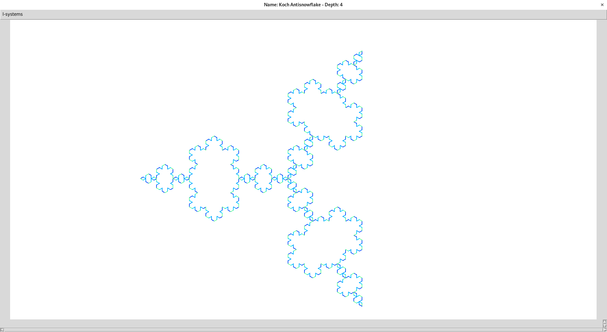

a great way to see how complex structures emerge from simple rules

[https://en.wikipedia.org/wiki/L-system](https://en.wikipedia.org/wiki/L-system)

requirements: python3.10 with tkinter

# How to use it:
* run it with `python3.10 Main.py`
* select which L-system to draw by clicking `l-systems` (top-left)

to remove / add / modify LSystems, edit [Model.py](Model.py)

